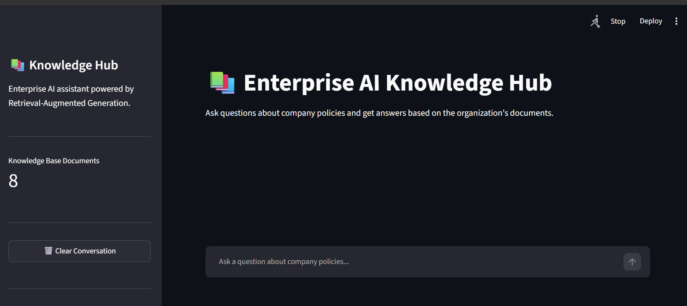
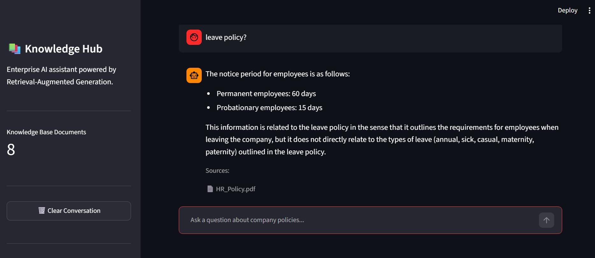
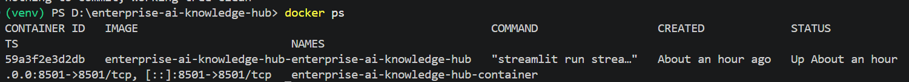

# Enterprise AI Knowledge Hub

> An enterprise-grade Retrieval-Augmented Generation (RAG) application for intelligent question answering over internal company documents.

[](https://www.python.org/)
[](https://streamlit.io/)
[](https://www.trychroma.com/)
[](https://www.docker.com/)
[](https://groq.com/)

---

## 📌 Overview

**Enterprise AI Knowledge Hub** is a Retrieval-Augmented Generation (RAG) application designed to provide accurate, context-aware answers from enterprise documents.

The system allows users to ask natural-language questions about company policies such as:

- HR policies
- Leave policies
- IT security policies
- Work-from-home policies
- Employee handbooks
- Code of conduct
- Travel policies
- Information security documentation

Instead of relying solely on an LLM's pretrained knowledge, the application retrieves relevant information from the organization's documents and provides that context to the LLM before generating an answer.

This architecture helps improve answer relevance, reduce hallucination, and provide source transparency.

---

## 🏗️ System Architecture

```text
                    ┌─────────────────────────┐
                    │   Enterprise PDF Files  │
                    └────────────┬────────────┘
                                 │
                                 ▼
                    ┌─────────────────────────┐
                    │       PDF Loader        │
                    │      PyPDF Processing   │
                    └────────────┬────────────┘
                                 │
                                 ▼
                    ┌─────────────────────────┐
                    │      Text Chunking      │
                    │   Overlapping Chunks    │
                    └────────────┬────────────┘
                                 │
                                 ▼
                    ┌─────────────────────────┐
                    │   Sentence Transformer  │
                    │   all-MiniLM-L6-v2      │
                    └────────────┬────────────┘
                                 │
                                 ▼
                    ┌─────────────────────────┐
                    │        ChromaDB         │
                    │     Vector Database     │
                    └────────────┬────────────┘
                                 │
                                 │
                     ┌───────────▼───────────┐
                     │     User Question     │
                     └───────────┬───────────┘
                                 │
                                 ▼
                    ┌─────────────────────────┐
                    │     Query Rewriting     │
                    │        Groq LLM         │
                    └────────────┬────────────┘
                                 │
                                 ▼
                    ┌─────────────────────────┐
                    │   Semantic Retrieval    │
                    │        ChromaDB         │
                    └────────────┬────────────┘
                                 │
                                 ▼
                    ┌─────────────────────────┐
                    │   Retrieved Context     │
                    └────────────┬────────────┘
                                 │
                                 ▼
                    ┌─────────────────────────┐
                    │       Groq LLM          │
                    │   Grounded Generation   │
                    └────────────┬────────────┘
                                 │
                                 ▼
                    ┌─────────────────────────┐
                    │      Streamlit UI       │
                    │   Answer + Source       │
                    └─────────────────────────┘


                    ## 📸 Application Screenshots

### Enterprise AI Knowledge Hub

The Streamlit interface provides an interactive chat experience for querying enterprise knowledge.



### RAG Question & Answer

The system retrieves relevant information from the knowledge base and generates a grounded response with source attribution.



### Dockerized Application

The application runs inside a Docker container with persistent ChromaDB storage.

